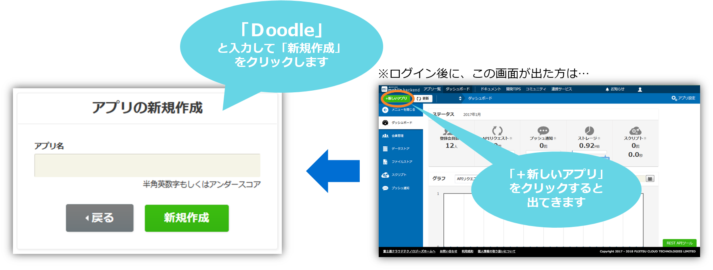
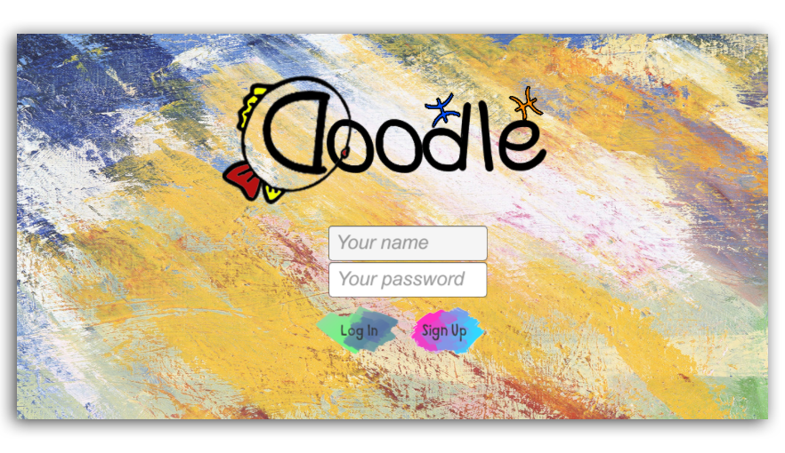
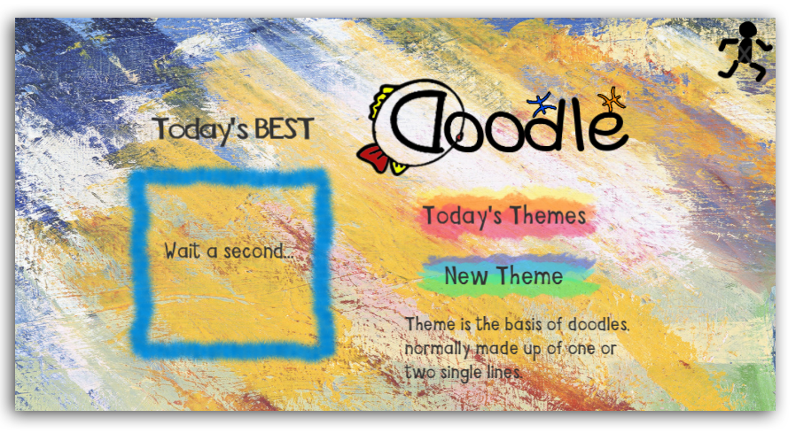

# 【Unity】想像力を目覚めさせる軽いゲームを作ろう！

## 概要
* [ニフクラmobile backend](https://mbaas.nifcloud.com/)の『ファイルストア機能』、『会員管理機能』、『データストア機能』を利用してUnityのサンプルプゲームプロジェクトです
* 簡単な操作ですぐに [ニフクラmobile backend](https://mbaas.nifcloud.com/)の機能を体験いただけます★★

## ニフクラmobile backendって何？？
スマートフォンアプリのバックエンド機能（プッシュ通知・データストア・会員管理・ファイルストア・SNS連携・位置情報検索・スクリプト）が**開発不要**、しかも基本**無料**(注1)で使えるクラウドサービス！今回はデータストアを体験します

注1：詳しくは[こちら](https://mbaas.nifcloud.com/function.htm)をご覧ください

## 動作環境
* Mac OS 12.5.1 (Monterey)
* Unity 2020.3.20f1 (LTS)
* Unity SDK v4.4.1
* Android studio: 4.0
* LG V20 plus (OS 8.0)
* Xcode Version 14.0
* iPhone X (iOS 16)

※上記内容で動作確認をしています。

## 手順
### 1. [ニフクラmobile backend](https://mbaas.nifcloud.com/)の会員登録とログイン→アプリ作成

* 上記リンクから会員登録（無料）をします。登録ができたらログインをすると下図のように「アプリの新規作成」画面が出るのでアプリを作成します

* アプリ作成されると下図のような画面になります
* この２種類のAPIキー（アプリケーションキーとクライアントキー）は次のステップで使用します。 

### 2. GitHubからサンプルプロジェクトの<a href="https://github.com/NIFCLOUD-mbaas/Doodle-DrawTogether/archive/master.zip">ダウンロード</a>

* 上記のリンクをクリックして、プロジェクトをダウンロード下さい。

### 3. Unityでアプリを起動

* ダウンロードしたフォルダを解凍し、Unityから開いてください。その後、loginシーンを開いてください。

### 4. APIキーの設定

* loginシーンの`NCMBSettings`を編集します
* 先程[ニフクラmobile backend](https://mbaas.nifcloud.com/)のダッシュボード上で確認したAPIキーを貼り付けます

* 貼り付けたらシーンを保存して下さい。

### 5. 動作確認
##### iOS端末へのビルド

* iOSビルド手順は以下のとおりです。  
iOS端末でビルドを行うには、Unityで.xcodeprojファイルを作成します。
- 「Build Settings」へ戻り、Platformで「iOS」を選択 -> 「Switch Platform」をクリックします。

- ボタンが「Build」に変わったらクリックします。アプリ名を入力するとビルドが開始されるので、完了したらXcodeで開いてください。

- XcodeでPush Notificationの追加とプロビジョニングファイルの設定を行う必要があります。[iOSのドキュメント](https://mbaas.nifcloud.com/doc/current/push/basic_usage_ios.html#Xcodeでの対応)の「5.1 Xcodeでの対応」を実装してください。

###### Xcodeの追加設定

  * iOSであり、Unity SDK v4.0.4以上の場合、Xcode側にて「WebKit.framework」「UserNotifications.framework」を追加する必要があります。
  * Xcodeで「Unity-iPhone」-> General -> TARGETで「UnityFramework」を選択します。追加されているライブラリ一覧の下にある「＋」をクリックします。
  
  * 検索窓にて「Web」と入力し、「WebKit.framework」があるので選択しAddをクリックします。

* 「UserNotifications.framework」ライブラリも同じように検索して追加します

ライブラリ一覧に追加されていることが確認できれば設定完了です。

※注意１: Unity SDK v4.2.0以上を使用している場合、上の２つに加えて「AuthencationServices.framework」も追加する必要があります。

* 「Build Phases」 タブで「AuthenticationServices.framework」を「Optional」にします。  

※注意２： Unity 2019.3未満の場合は、以下の画像のように TARGET->「Unity-iPhone」でフレームワークを追加するようにしてください。
こちらも「WebKit.framework」「UserNotifications.framework」「AuthenticationServices.framework」を追加する必要があります。

- 上記が完了しましたら、iOS動作確認は可能となります。

* Unity画面で上部真ん中の実行ボタン（さんかくの再生マーク）をクリックしして、ゲームを体験しましょう！

 

### ①アカウント登録
* 自分が好きなニックネームとパスワードを入力し、「Sign Up」ボタンをクリックして下さい。（2回目以降は`your name`と`your password`を入力してLog Inボタンをタップします）

 * 次の画面が出てきたら、登録成功です。

---------
* ダッシュボードで動作確認しましょう！
  1. ニフクラmobile backendの<a href="https://console.mbaas.nifcloud.com">ダッシュボード</a>で、左の「会員管理」をクリックして下さい。
  2. 先ほど作成したアカウントを確認しましょう。

### ②テーマとDoodleの保存
* 「New Theme」ボタンをクリックし、簡単な絵を描きましょう。ここで描いた絵は、テーマとして、Doodle（落書き）の基礎になります。
* 描き終わったら、「submit」ボタンをクリックして保存して下さい。

* テーマを保存したら、Doodleを描きましょう！
 1. メイン画面の「Today's Theme」ボタンをクリックして、次の画面で、先に描いたテーマを選択して下さい。
 2. 「Draw my doodle」をクリックし、先に描いたテーマを基にして、Doodleを描きましょう！
 3. 描き終わったら、「Submit」ボタンをクリックして保存して下さい。

* 保存したDoodleは、次の画面で確認できます。 

--------

* 描いたテーマとDoodlleを<a href="https://console.mbaas.nifcloud.com">ダッシュボード</a>で確認しましょう！
  1. ダッシュボードの左にある「ファイルストア」をクリックして下さい。
  2. 保存したテーマとDoodleのファイルは画面の右で確認できます。
  

-----

* ファイルストアには、画像ファイルのみが保存されます。絵の作者やタイプ（Doodleかテーマか）などの情報を一緒に管理するにはデータストアを利用します。
  - このアプリでは「DoodleRecord」というクラスをデータストアに作成し管理しています。
* データストアも確認しましょう！
  1. <a href="https://console.mbaas.nifcloud.com">ダッシュボード</a>で、左側の「データストア」をクリックし、「DoodleRecord」というクラスをクリックして下さい。
  2. 右の画面で、先に保存しましたなテーマとDoodleのレコードを確認できます。

## 機能解説
ユーザー登録と画像データの保存、絵を描く、ランキング機能などの具体的な解説は<a href="機能解説.md">機能解説ドキュメント</a>をご参照下さい：

<ul>
  <li><a href="機能解説.md#q1">『機能一』ユーザー登録とログイン（会員管理）</a>
  ★☆☆☆☆</li>
  <li><a href="機能解説.md#q2">『機能二』落書き機能</a>
  ★★★★☆</li>
  <li><a href="機能解説.md#q3">『機能三』画像の保存と取得（ファイルストア）</a>
  ★★☆☆☆</li>
  <li><a href="機能解説.md#q4">『機能四』画像に関するデータの保存と取得（データストア）</a>
  ★☆☆☆☆</li>
  <li><a href="機能解説.md#q5">『機能五』人気ランキング機能（データストア）</a>
  ★★★☆☆</li>
</ul>

## 参考
* ニフクラmobile backend の[ドキュメント（会員管理）](https://mbaas.nifcloud.com/doc/current/user/basic_usage_unity.html)
* ニフクラmobile backend の[ドキュメント（ファイルストア）](https://mbaas.nifcloud.com/doc/current/filestore/basic_usage_unity.html)
* ニフクラmobile backend の[ドキュメント（データストア）](https://mbaas.nifcloud.com/doc/current/datastore/basic_usage_unity.html)
* このアプリの[機能解説ドキュメント](/機能解説.md)
